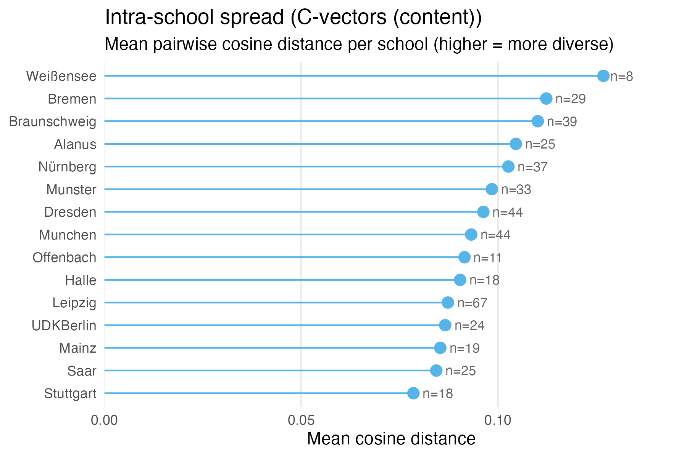
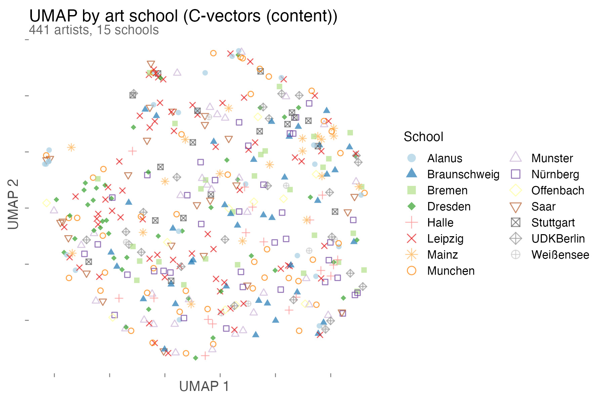
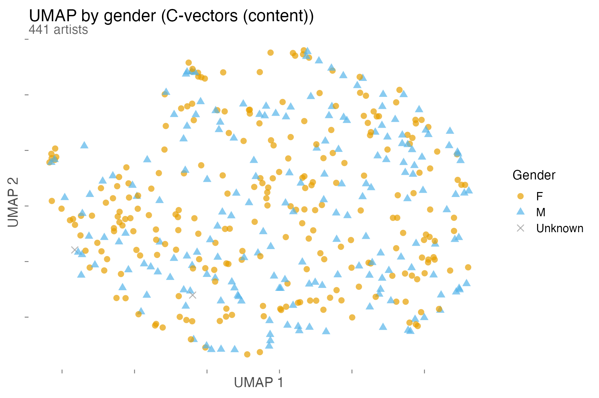
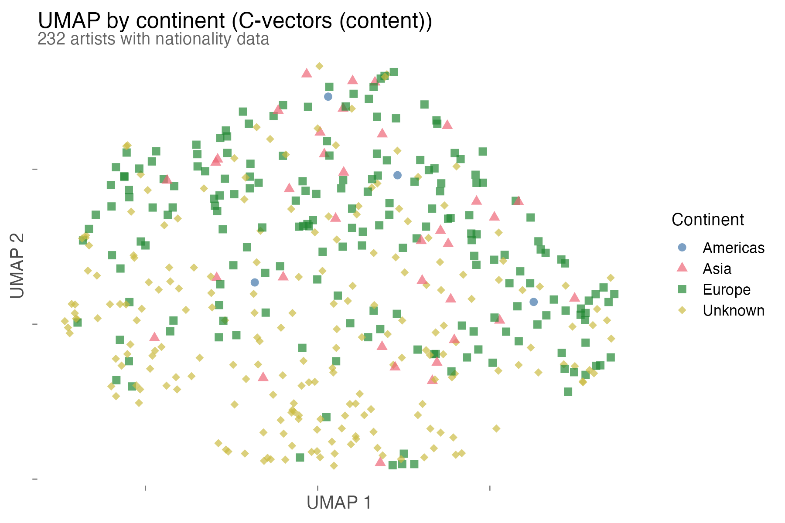
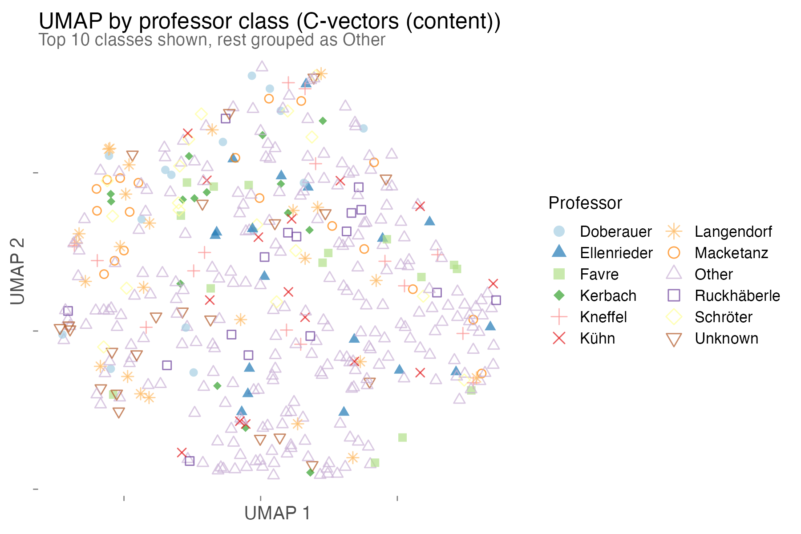

# contempArt CLIP Analysis Report

Generated: 2026-03-29

- [Step 1: Embeddings](#step-1-embeddings)
- [Step 2: Statistical Tests](#step-2-statistical-tests-c-vectors-content)
- [Step 3: Visualizations](#step-3-visualizations-c-vectors-content)
- [Step 4: Social Network Analysis](#step-4-social-network-analysis)

See [comparison.md](comparison.md) for a detailed side-by-side with the original 2020 paper.

## Step 1: Embeddings

- C-vectors (CLIP ViT-L/14): 14,393 images, 768 dims, 441 artists
- C-vector failures: 5 corrupt PNGs from artist luanlamberty (PIL cannot read)
- Full manifest: 14,398 images, 441 artists (from 441 of 442 original artist folders)
- A-vectors (SD 2.0 VAE, 16,384 dims): pending overnight run

## Step 2: Statistical Tests, C-vectors (content)

441 artists, 50 PCA components (82.1% variance), overall cosine spread 0.0997.

| Test | Variable | Statistic | p-value | Significant (p<0.05)? |
|------|----------|-----------|---------|----------------------|
| Mantel | school | r=0.0302 | 0.0003 | yes |
| PERMANOVA | school | F=3.2486 | 0.0001 | yes |
| Mantel | gender | r=0.0103 | 0.18 | no |
| PERMANOVA | gender | F=5.0042 | 0.0001 | yes |
| Mantel | nationality | r=-0.0932 | 0.08 | no |
| PERMANOVA | nationality | F=0.7496 | 0.84 | no |
| Mantel | professor_class | r=0.0277 | 0.0001 | yes |
| PERMANOVA | professor_class | F=2.3374 | 0.0001 | yes |

Mantel: permutation-based Pearson correlation between embedding distance matrix and categorical distance matrix (same group = 0, different group = 1), 9999 permutations. PERMANOVA: permutation-based multivariate ANOVA testing whether group centroids differ in embedding space, 9999 permutations.

## Step 3: Visualizations, C-vectors (content)

Plots generated by R/ggplot2 (R/visualize.R). Palettes: Brewer Paired (school, professor), Okabe-Ito (gender), Paul Tol bright (continent). All use redundant shape aesthetics for colorblind accessibility.

## Step 4: Social Network Analysis

Uses the original paper's pre-computed node2vec distance matrices (stored in data/original_2020/, not recomputed). This ensures the social network side of the comparison is identical to the original paper.

- G^U: artist-to-artist network, 364 nodes, cosine distance on 128-dim node2vec
- G^Y: full network (247,087 nodes), artist subset extracted, cosine distance on 128-dim node2vec
- Artists in common between social network and CLIP embeddings: 364

### Embedding vs social network (Mantel test, 9999 permutations)

| Comparison | Mantel r | p-value | Spearman rho | Significant? |
|------------|----------|---------|--------------|--------------|
| C-vectors vs G^U | r=0.1106 | 0.0095 | rho=0.0588 | yes |
| C-vectors vs G^Y | r=0.0019 | 0.9606 | rho=0.0184 | no |
| VGG style (2020) vs G^U | r=0.0421 | 0.2376 | rho=-0.0045 | no |
| VGG style (2020) vs G^Y | r=-0.0365 | 0.2207 | rho=-0.0287 | no |

n=364 artists. Mantel r = Pearson correlation on distance matrices with permutation p-value. Spearman rho = rank correlation on flattened upper triangle, matching the method used in the original paper's Table 3. VGG style = original cosine distance from VGG FC7 centroids (50th percentile aggregation, symmetric).

CLIP content shows a significant correlation with artist-to-artist social proximity (G^U) that VGG style does not, using the same statistical test on the same social network data. Neither feature type correlates with the full network G^Y.
