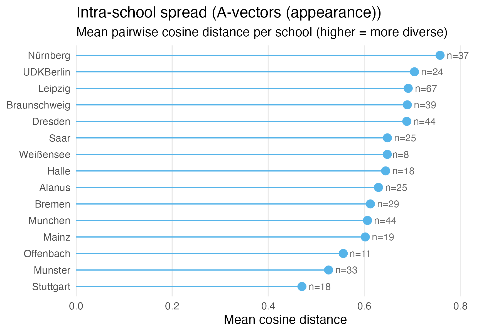
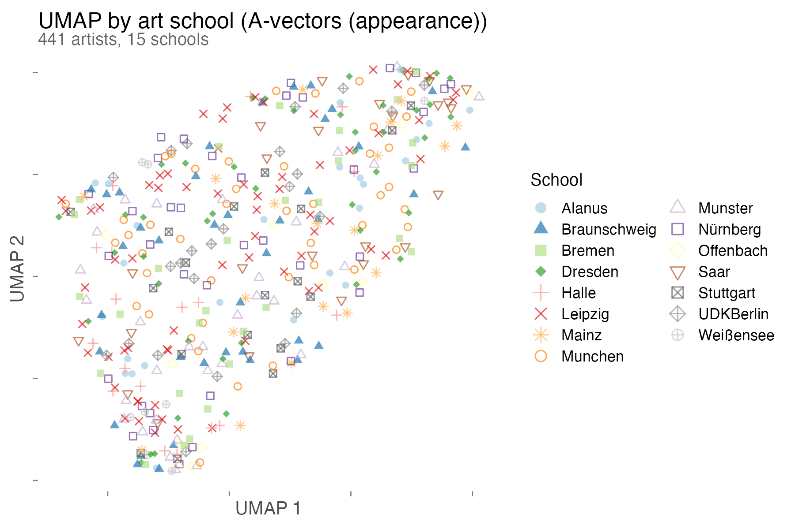
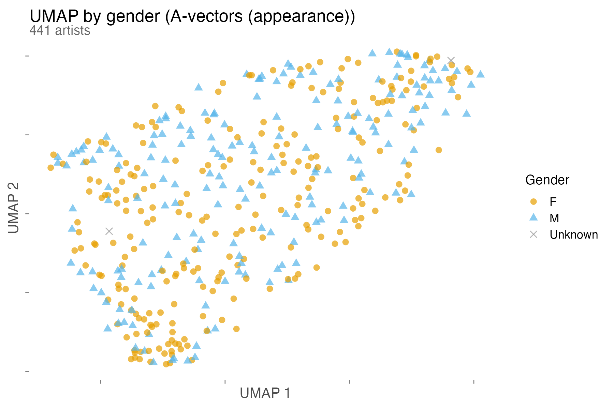
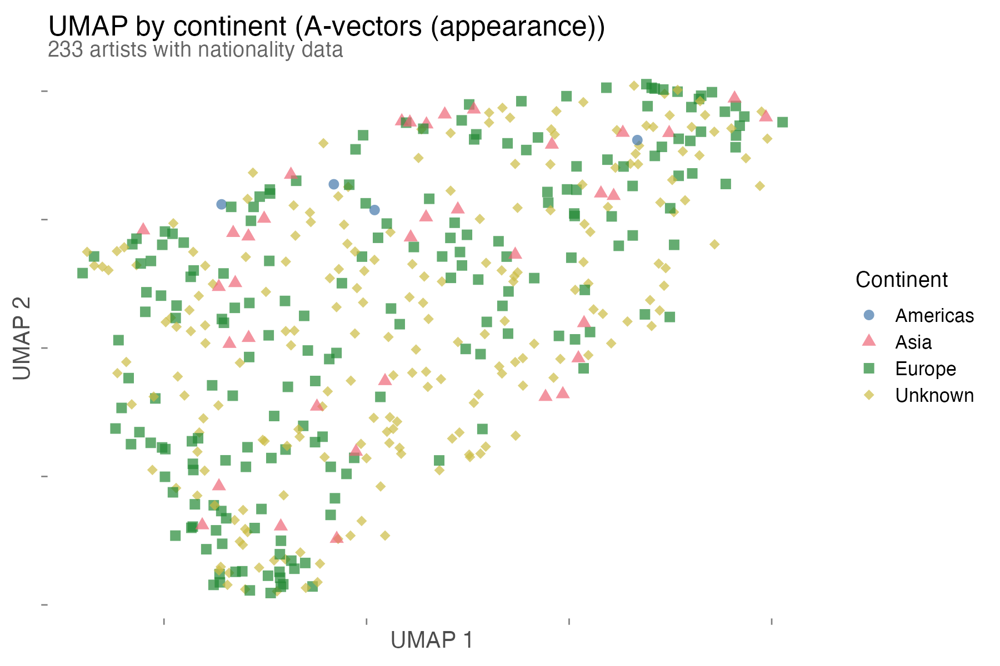
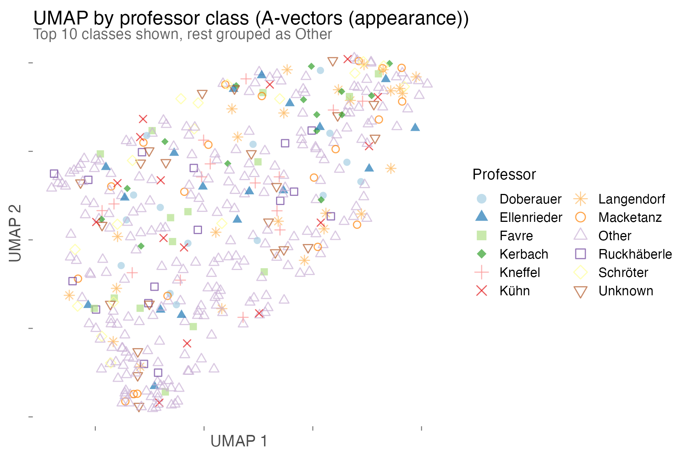

# contempArt CLIP Analysis Report

Generated: 2026-03-29

- [Step 1: Embeddings](#step-1-embeddings)
- [Step 2: Statistical Tests](#step-2-statistical-tests) (Mantel, PERMANOVA, db-RDA)
- [Step 3: Visualizations](#step-3-visualizations)
- [Step 4: Social Network Analysis](#step-4-social-network-analysis)

See [comparison.md](comparison.md) for a detailed side-by-side with the original 2020 paper.

## Step 1: Embeddings

- C-vectors (CLIP ViT-L/14): 14,393 images, 768 dims, 441 artists
- A-vectors (SD 2.0 VAE): 14,393 images, 16,384 dims, 441 artists
- Failures: 5 corrupt PNGs from artist luanlamberty (same for both)
- Full manifest: 14,398 images, 441 of 442 original artists

## Step 2: Statistical Tests

### C-vectors (content)

441 artists, 50 PCA components (82.1% variance), overall cosine spread 0.0997.

| Test | Variable | Statistic | p-value | Significant (p<0.05)? |
|------|----------|-----------|---------|----------------------|
| Mantel | school | r=0.0302 | 0.0001 | yes |
| PERMANOVA | school | F=3.2486 | 0.0001 | yes |
| Mantel | gender | r=0.0103 | 0.18 | no |
| PERMANOVA | gender | F=5.0042 | 0.0001 | yes |
| Mantel | nationality | r=-0.0932 | 0.08 | no |
| PERMANOVA | nationality | F=0.7496 | 0.84 | no |
| Mantel | professor_class | r=0.0277 | 0.0001 | yes |
| PERMANOVA | professor_class | F=2.3374 | 0.0001 | yes |

### A-vectors (appearance)

441 artists, 50 PCA components (84.7% variance), overall cosine spread 0.6592.

| Test | Variable | Statistic | p-value | Significant (p<0.05)? |
|------|----------|-----------|---------|----------------------|
| Mantel | school | r=0.0001 | 0.99 | no |
| PERMANOVA | school | F=1.9478 | 0.004 | yes |
| Mantel | gender | r=0.0195 | 0.007 | yes |
| PERMANOVA | gender | F=4.0309 | 0.02 | yes |
| Mantel | nationality | r=-0.0097 | 0.77 | no |
| PERMANOVA | nationality | F=1.0533 | 0.37 | no |
| Mantel | professor_class | r=0.0033 | 0.43 | no |
| PERMANOVA | professor_class | F=1.5525 | 0.003 | yes |

### Summary across both embeddings

| Variable | C-vectors Mantel | C-vectors PERMANOVA | A-vectors Mantel | A-vectors PERMANOVA |
|----------|-----------------|--------------------|-----------------|--------------------|
| School | r=0.030, p=0.0001 | F=3.25, p=0.0001 | r=0.000, p=0.99 | F=1.95, p=0.004 |
| Gender | r=0.010, p=0.18 | F=5.00, p=0.0001 | r=0.020, p=0.007 | F=4.03, p=0.02 |
| Nationality | r=-0.093, p=0.08 | F=0.75, p=0.84 | r=-0.010, p=0.77 | F=1.05, p=0.37 |
| Professor | r=0.028, p=0.0001 | F=2.34, p=0.0001 | r=0.003, p=0.43 | F=1.55, p=0.003 |

C-vectors (content) show strong school and professor effects in both tests. A-vectors (appearance) show weaker effects, significant only in PERMANOVA (centroid differences) but not Mantel (pairwise distances). Gender is significant for both embedding types in PERMANOVA. Nationality shows no signal in either.

### db-RDA (distance-based Redundancy Analysis)

Mantel and PERMANOVA test one variable at a time. This is a problem because school and professor are confounded (professors work at specific schools). db-RDA solves this by fitting all variables simultaneously and testing each one's unique contribution after controlling for the others. It is multivariate regression on distance matrices: the 441x441 pairwise cosine distance matrix is converted to principal coordinates, then regressed against the demographic variables. Significance is assessed via 9,999 permutations.

#### C-vectors (content)

Total variance explained by all demographics: 24.5% (F=2.71, p=0.0001).

Marginal tests (Type II, each variable controlling for all others):

| Variable | Df | Var. explained | F | p-value | Significant? |
|----------|---:|---------------:|----:|--------:|---|
| Professor class | 28 | 10.5% | 1.76 | 0.0001 | yes |
| Continent | 3 | 3.5% | 5.49 | 0.0001 | yes |
| Gender | 2 | 1.4% | 3.17 | 0.013 | yes |
| School | 1 | 0.6% | 2.95 | 0.044 | yes (weak) |

Variance partition (school vs professor):
- School alone: 0.4%
- Professor alone: 5.0%
- Shared (attributable to either): 6.3%

The school effect is almost entirely explained by who teaches there. Professor class is the real driver.

Continent emerges as significant (p=0.0001) once school and professor are controlled for. This was masked in the Mantel test (p=0.08) because continent correlates with school choice.

#### A-vectors (appearance)

Total variance explained by all demographics: 16.4% (F=1.64, p=0.0007).

| Variable | Df | Var. explained | F | p-value | Significant? |
|----------|---:|---------------:|----:|--------:|---|
| Gender | 2 | 2.0% | 2.98 | 0.023 | yes |
| Continent | 3 | 2.5% | 2.48 | 0.026 | yes |
| Professor class | 28 | 11.6% | 1.23 | 0.12 | no |
| School | 1 | 0.4% | 1.09 | 0.33 | no |

Only gender and continent predict appearance. School and professor have no effect. The institutional factors that shape content do not shape how the art looks.

## Step 3: Visualizations

Plots generated by R/ggplot2 (R/visualize.R). All use redundant shape aesthetics for colorblind accessibility.

### C-vectors (content)

### A-vectors (appearance)

## Step 4: Social Network Analysis

Uses the original paper's pre-computed node2vec distance matrices (stored in data/original_2020/, not recomputed).

- G^U: artist-to-artist network, 364 nodes, cosine distance on 128-dim node2vec
- G^Y: full network (247,087 nodes), artist subset, cosine distance on 128-dim node2vec
- Artists in common between embeddings and social network: 364

### Embedding vs social network (Mantel test, 9999 permutations)

| Comparison | Mantel r | p-value | Spearman rho | Significant? |
|------------|----------|---------|--------------|--------------|
| C-vectors vs G^U | r=0.1106 | 0.009 | rho=0.0588 | yes |
| C-vectors vs G^Y | r=0.0019 | 0.96 | rho=0.0184 | no |
| A-vectors vs G^U | r=0.0131 | 0.66 | rho=0.0033 | no |
| A-vectors vs G^Y | r=0.0383 | 0.13 | rho=0.0282 | no |
| VGG style (2020) vs G^U | r=0.0421 | 0.25 | rho=-0.0045 | no |
| VGG style (2020) vs G^Y | r=-0.0365 | 0.23 | rho=-0.0287 | no |

n=364 artists. Only C-vectors (content) show a significant correlation with the artist-to-artist social network. A-vectors (appearance) and VGG style (texture) do not. No embedding type correlates with the full network G^Y.
